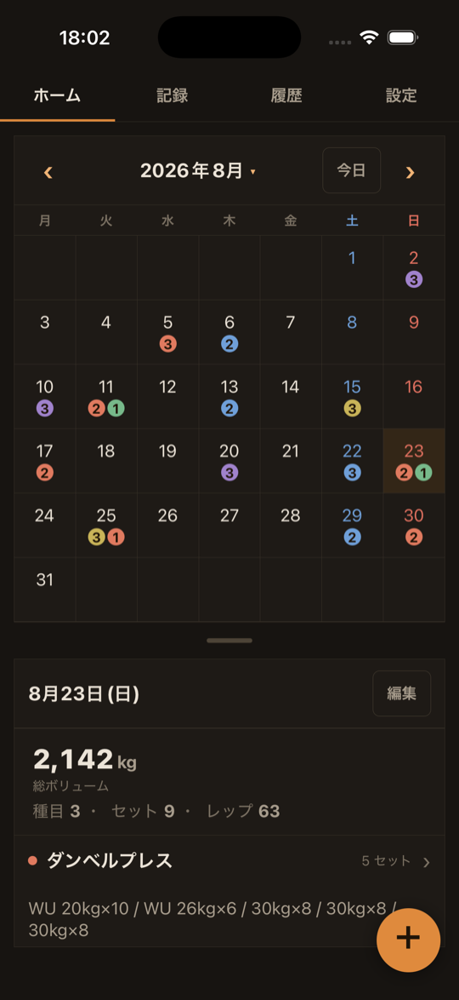
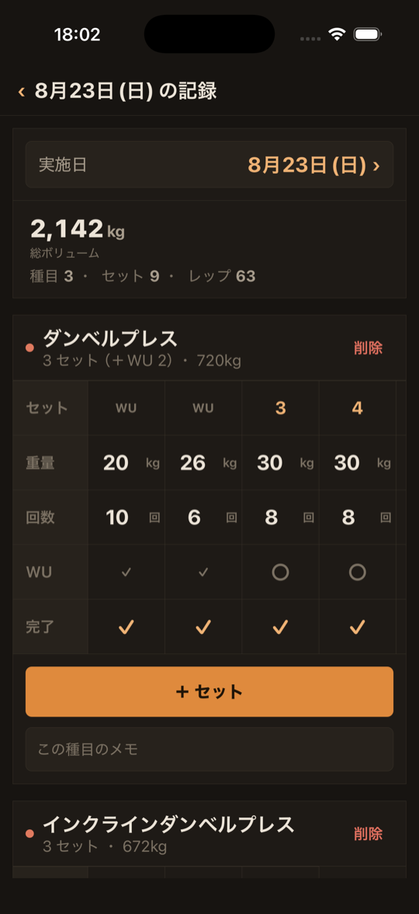
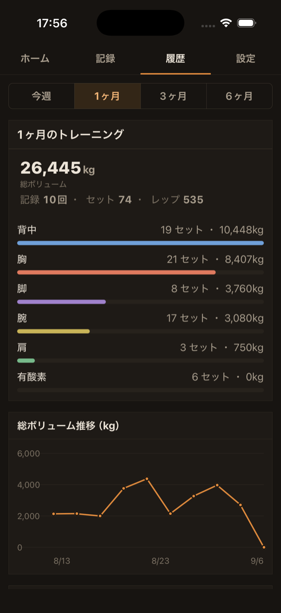
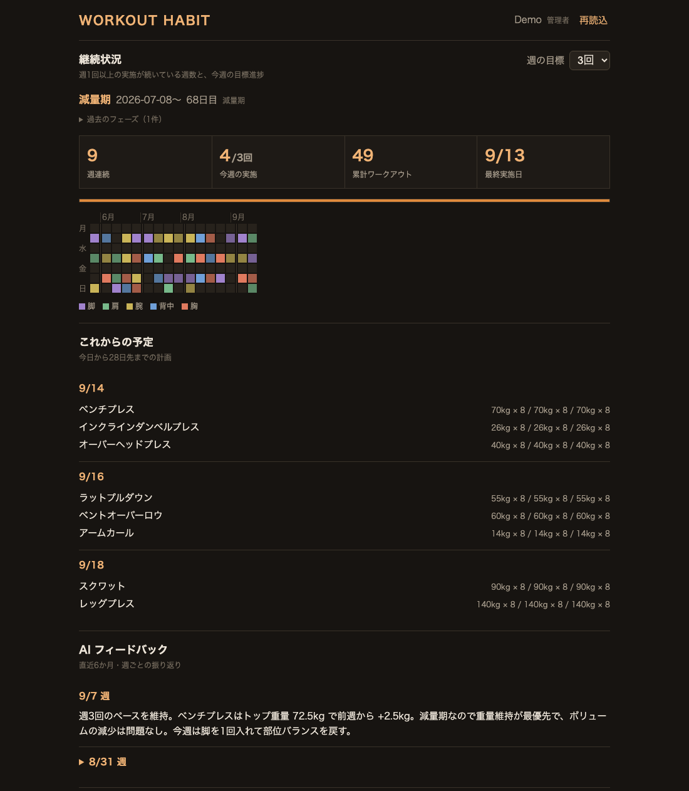
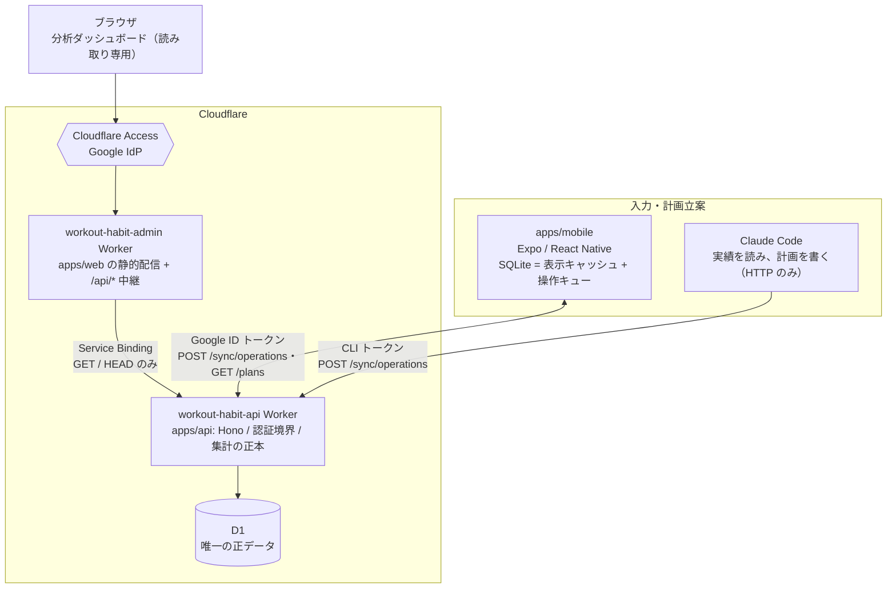

# Workout Habit

筋トレの記録を「次の行動」につなげる、個人開発のトレーニング支援プロダクトです。
スマホで記録し、ブラウザで振り返り、Claude Code と対話して次の計画を立てる。
その3つを1つのデータ基盤（Cloudflare D1）の上でつなぐモノレポです。


## 何を解決するか

既存の筋トレ記録アプリは「記録」は充実している一方で、**記録を解釈して次に何をするかを決める**部分が弱い。
このプロダクトは、その先を担う設計にしています。

| 課題 | このアプリの答え |
|---|---|
| 記録はできても、伸びているのか停滞しているのか分からない | 週次・月次の推移、部位別ボリューム、種目別の推定 1RM をブラウザで一覧できる |
| 減量期・引っ越しなどの背景を知らないと数字を誤読する | 「減量 / 増量 / 維持 / 中断」の**フェーズ履歴**と目的（筋力 / 筋肥大）をデータとして持つ |
| 次のメニューを考えるのが面倒で、同じ内容を惰性で繰り返す | **Claude Code が実績・フェーズ・目標を読んで計画を書き込み**、スマホに「予定」として届く |
| ジムで電波が無い、アプリの起動が遅い | オフライン優先。端末内 SQLite に即時保存し、あとから操作単位で同期する |

## スクリーンショット

| ホーム（カレンダー＋その日の記録） | 記録の編集（ウォームアップ・完了の管理） | 履歴（部位別ボリュームと推移） |
|:-:|:-:|:-:|
|  |  |  |

分析ダッシュボード（ブラウザ）。継続状況のヒートマップ、Claude Code が書き込んだ予定と週次フィードバック、推移グラフを1画面にまとめています。



※ ダッシュボードの画像はデモデータで撮影しています。

## Architecture



### 3アプリの責務境界

| ディレクトリ | 役割 | 責務 |
|---|---|---|
| `apps/mobile/` | 入力 | トレーニング記録の唯一の入力経路。オフラインでも止まらない。端末内 SQLite は表示用キャッシュ＋操作キュー |
| `apps/api/` | サーバ | **D1 の所有者（正データ）**、3経路の認証境界、集計ロジックの正本 |
| `apps/web/` | 管理画面 | 読み取り専用の分析ダッシュボード。集計はせず、API の結果を表示整形するだけ |

Claude Code は4つ目のクライアントで、モバイルと同じ同期 API で計画を書きます。専用の書き込み API は持ちません。

### 設計上の判断

- **D1 を唯一の正にし、端末は薄い層にする。** 端末とサーバの二重管理をやめ、書き込み経路を「ローカル即時反映＋キュー積み」の1本に統一。競合は後勝ち
- **同期は操作（intent）ベース。** 行レベルの汎用 `upsert` / `delete` を冪等台帳つきで受け、部分成功を操作ごとに返す。全置換バックアップは廃止
- **管理画面と API を同一オリジンに寄せる。** Cloudflare Access はホスト単位でしか JWT を付けないため、配信 Worker が Service Binding で API へ中継。CORS を持たない
- **認証は fail closed。** Access JWT（署名・aud・iss・exp を検証、JWKS は動的取得）、Google ID トークン、CLI トークン（SHA-256 ハッシュのみ保存）の3経路。Secret 未設定なら 500 で止まり、認証をスキップしない
- **認可は行スコープで強制。** `WHERE user_id = ?` を route に散らさず、スコープ生成を1か所に集約。admin も無制限にしない
- **共有プリセット種目はユーザー別の上書きテーブルで調整。** 名前・部位は変えさせず、休憩時間・バー重量・非表示だけを上書きし、同じ ID が人によって別の種目を指す事故を防ぐ

## 技術スタック

| 領域 | 採用 |
|---|---|
| モバイル | Expo SDK 56 / React Native 0.85（New Architecture） / React 19 / expo-sqlite / expo-notifications / Google Sign-In |
| API | Hono 4 / Cloudflare Workers / D1（SQLite） / Rate Limiting binding / Web Crypto による JWT 検証（自前実装） |
| 管理画面 | Vite 7 / React 19 / Chart.js（折れ線・積み上げバー） / 自作 SVG ヒートマップ / Workers Static Assets + Service Binding |
| 認証・認可 | Cloudflare Access（Google IdP） / Google ID トークン / CLI トークン、`admin` と `member` の2ロール |
| 品質 | TypeScript `strict`（3アプリ） / ESLint（typescript-eslint type-checked） / Prettier / Jest（jest-expo、テストファイル 58 本） |
| 運用 | Wrangler / D1 migrations（9本） / Workers Observability / セキュリティヘッダ（CSP・HSTS）を配信 Worker で付与 |

外部ライブラリは最小限にしています。モバイルのナビゲーションは自前の state 方式、状態管理は React 標準、グラフは自作コンポーネントです。

## 主な機能

- ワークアウトの記録（種目・セット・重量・レップ・ウォームアップ区別）と、予定・テンプレートからの開始
- レストタイマー（バックグラウンドでも終了を通知。残り秒ではなく終了時刻を保存して復元）
- 種目マスタの管理、部位・名前での絞り込み、プレート計算、Epley 式による推定 1RM と RM 換算表
- 履歴のカレンダー表示（部位色のマーカー）、体重・体脂肪率のボディログ、月額ジム代の 1 回あたり単価
- 操作単位でのクラウド同期（オフライン中はキューに溜め、復帰時・種目完了時に送信。未送信が残る間だけ定期再送）
- ブラウザでの分析（継続状況ヒートマップ、週次・月次推移、部位別ボリューム、種目別推移と目標線、ボディログ）
- **Claude Code との連携** — 実績・フェーズ・目標を API から読み、対話で組んだ計画と週次フィードバックを書き込む。モバイルは予定として取り込む

## セットアップ

前提: Node.js、Xcode（iOS ビルド用）、Cloudflare アカウント。

> **リポジトリは ASCII のみのパスへ置いてください。** 日本語などマルチバイト文字を含む
> ディレクトリ配下では、React Native のプリビルド取得が失敗して iOS ビルドが通りません。
> 詳細は `.agents/rules/mobile-react-native.md` を参照してください。

```bash
git clone git@github.com:shogo-tanaka-work/workout-habit-app.git
cd workout-habit-app
npm --prefix apps/mobile install
npm --prefix apps/api install
npm --prefix apps/web install
```

### モバイルアプリ

```bash
npm --prefix apps/mobile run ios     # 実機 / シミュレータで起動
npm --prefix apps/mobile run start   # Metro のみ起動
```

### API Worker（workout-habit-api）

D1 データベースを作成し、`apps/api/wrangler.jsonc` の `database_id` を自分のものに差し替えます。

```bash
cd apps/api
npx wrangler d1 create workout-habit-db
npx wrangler d1 migrations apply workout-habit-db --remote
npx wrangler secret put ACCESS_TEAM_DOMAIN  # Cloudflare Access のチームドメイン
npx wrangler secret put ACCESS_AUD          # Access アプリケーションの AUD
npx wrangler secret put GOOGLE_CLIENT_IDS   # モバイルの Google クライアント ID（カンマ区切り）
npm run deploy
```

**Secret は API Worker 側に置きます。** Access アプリ（守る対象のホスト指定）を掛けるのは
管理画面ホストですが、JWT を検証するのは API Worker だからです。
未設定のまま起動すると、認証をスキップせず 500 で止まります（fail closed）。

### 管理画面 Worker（workout-habit-admin）

環境変数の設定は不要です。API は同一オリジンの `/api/*` にあり、
Worker が Service Binding で API Worker へ中継します。

```bash
npm --prefix apps/web run dev      # ローカル開発（/api/* は 404。レイアウト確認用）
npm --prefix apps/web run deploy   # ビルド → デプロイ
```

デプロイ後、Cloudflare Access をこの Worker のホストへ適用してください。

## 運用

### Claude Code から API を使う

トレーニング計画の立案から端末への反映までの手順は
**[`.agents/memory/claude-code-integration.md`](.agents/memory/claude-code-integration.md)** にあります。
CLI トークンの用意、実績・フェーズ・目標の読み取り、計画と週次フィードバックの書き込み、`GET /plans` での取り込みまで。

API トークンと接続先は、**リポジトリルートの `.env.local`** に置きます。
このファイルは `.gitignore` 済みで、リポジトリには含まれません。

```bash
set -a && . ./.env.local && set +a   # 環境変数として読み込む
```

トークンは D1 にハッシュしか保存されないため、平文はこのファイルにしか残りません。
**画面へ出力しないでください**（ターミナルの履歴や、AI へ貼ったログに残ります）。
漏れた場合は `api_tokens` の該当行を失効させて作り直します。

## 開発

規約・デザイン方針・構成メモはリポジトリルートの `.agents/` に集約しています。
AI エージェント（Claude Code / Codex）が実装前に読む前提で、責務境界とルールの読み込み順を明文化しています。

- `.agents/AGENTS.md` — 入口。3アプリの責務境界とルールの読み込み順
- `.agents/DESIGN.md` — ビジュアルデザインの正本
- `.agents/rules/` — 対象に応じて読むコーディング規約
- `.agents/memory/roadmap.md` — 実行計画と決定済み方針

```bash
npm --prefix apps/mobile test
npm --prefix apps/mobile run typecheck
npm --prefix apps/mobile run lint
npm --prefix apps/web run build
npm --prefix apps/api run typecheck
```

## ライセンス

[MIT](LICENSE)
